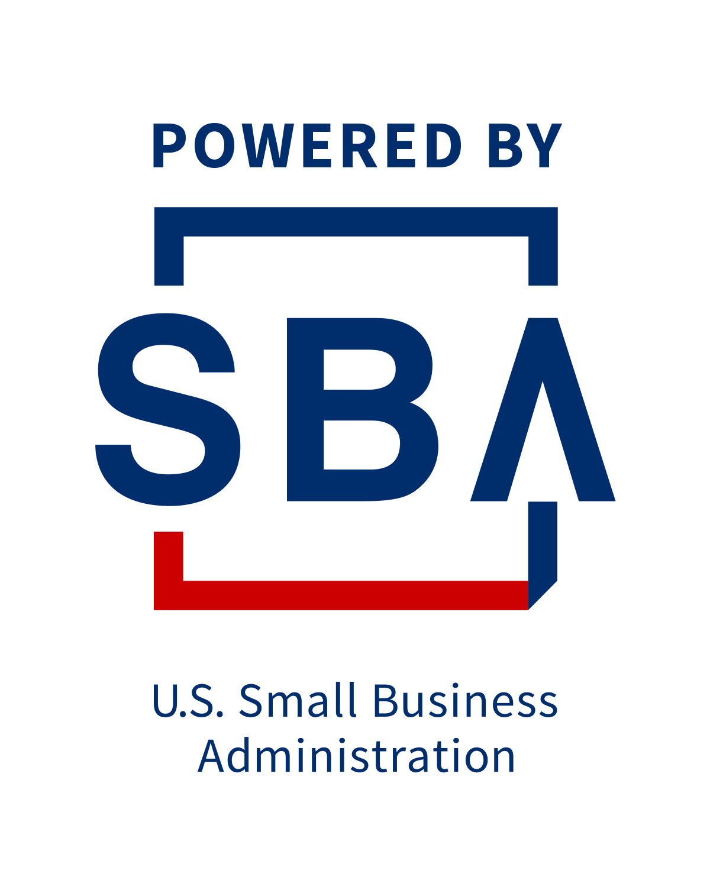
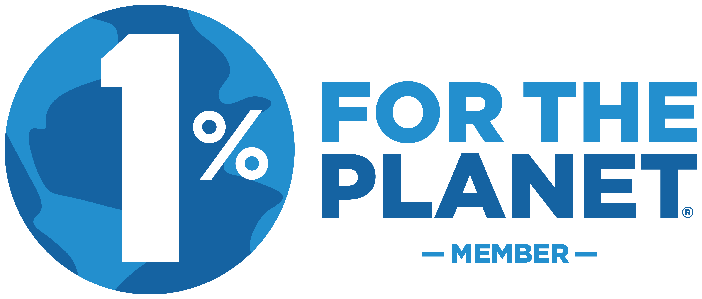

**Openscapes LLC** was formed in 2022 to support the [Openscapes](https://openscapes.org) open source community.

Openscapes LLC is a certified Woman-Owned Small Business (WOSB) by the U.S. Small Business Administration (SBA). It is registered in SAM.gov (UEI: TCKAB6AHWL25, CAGE: 9BCJ7). 

Openscapes ® is a registered trademark.

<!---  --->
------------------------------------------------------------------------

Openscapes LLC strongly believes that open science plays a critical role in climate solutions and justice. We joined [1% for the Planet](https://www.onepercentfortheplanet.org/) in 2024, and as a member we donate at least 1% of revenue each year to environmental non-profits.

