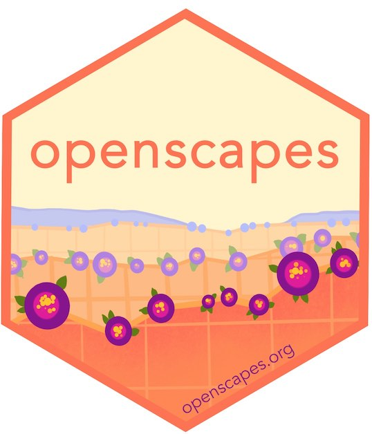

```{r setup, include=FALSE}
knitr::opts_chunk$set(echo = FALSE)
library(tidyverse)
```

# Openscapes

[**Openscapes**](https://openscapes.org) is an approach for kinder, better science in less time. We approach open science as a spectrum, as a behavior change, and as a movement. We blog at [openscapes.org/blog](https://openscapes.org/blog).

- [**Openscapes Champions Program**](https://openscapes.org/champions) is an open data science mentorship program for science teams
- [**NASA Openscapes Framework**](https://nasa-openscapes.github.io) supports scientists using data from NASA Earthdata served from the Distributed Active Archive Centers (DAACs) as they migrate workflows to the cloud

<!---
<a align="left" href="https://openscapes.org/champions"></a> 
--->

---

# Teaching

- [**R for Excel Users**](https://rstudio-conf-2020.github.io/r-for-excel/) by Lowndes & Horst is for Excel users who want to add or integrate R and RStudio into their existing data analysis toolkit. Originally taught at the 2020 RStudio Conference, it is a friendly intro to becoming a modern R user, full of tidyverse, RMarkdown, GitHub, collaboration & reproducibility and written to be used as a reference, to teach, or as self-paced learning.
- [**Tidy Data Illustrated Series**](/blog/2020/10/12/tidy-data) by Horst & Lowndes is artwork to illustrate why tidy data is so powerful for efficiency, reproducibility, and collaboration. 


<!---

---

# Ocean Health Index

[**The Ocean Health Index**](https://ohi-science.org) is a scientific framework used to measure how healthy oceans are. I was an OHI science program lead from 2013-2019 and helped amplify our transformation to open data science. 

- [**Our path to better science in less time using open data science tools**](https://www.nature.com/articles/s41559-017-0160) by Lowndes et al. 2017 describes how our open data science tranformed our team's approach to reproduciblity, collaboration, and communication.
- [**OHI Global Assessments**](http://ohi-science.org/ohi-global/) are updated annually since 2012 with the best available data and knowledge. 


--->

---

# Consulting

I consult with teams interested in open data science practices with their groups and communities. 

<!---
# Open communities

I have built so much confidence from inclusive and welcoming open communities, who have been instrumental in my growth as an open science contributor.

- [rOpenSci](https://ropensci.org) R package contributor
- [RStudio](https://rstudio.com) collaborator
- [Carpentries](https://thecarpentries.org) instructor
- [Eco-Data-Science](https://eco-data-science.github.io) co-founder
- [RLadies Santa Barbara](https://www.meetup.com/rladies-santa-barbara/) co-founder
- [Mozilla](https://blog.mozilla.org/en/mozilla/news/mozilla-announces-25-new-fellows-in-openness-science-and-tech-policy/) fellow

--->


